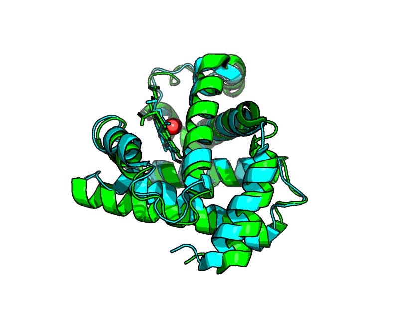

# Mol* Tutorial

!!! note
    This cheat sheet, with edits, is from the [complete Mol* documentation](https://molstar.org/viewer-docs/).

## General Interface


### Navigate the 3D Canvas


| Action | How to |
|--------|--------|
| **Rotate** | Left mouse button + drag, or Shift + left mouse button + drag |
| **Zoom** | Mouse wheel. On touchpad: two-finger drag. On touchscreen: pinch two fingers |
| **Move** | Right mouse button + drag, or Ctrl + left mouse button + drag. On touchscreen: two-finger drag |
| **Center and zoom** | Right mouse button click on the part of the structure you wish to see |
| **Change clipping planes** | Shift + mouse wheel. On touchpad: Shift + two-finger drag |


## Toggle Menu

<div style="text-align: center; margin-bottom: 1rem;">
  
</div>

Mol\* has two modes that change the behavior of a click. Switch between them using the **Selection Mode icon** (shaped like a cursor) in the Toggle Menu.

**Default Mode:** A click on a residue focuses on it. The focused residue and its surroundings are displayed in ball & stick representation with all local non-covalent interactions shown. Click again to hide surroundings.

**Selection Mode:** A click on a residue selects it. Selected parts appear with a bright green tint in the 3D canvas and Sequence Panel. Holding Shift while clicking extends the selection along the polymer from the last clicked residue.

## How To...

### Select

1. Open Selection Mode (cursor symbol in Toggle Menu)
2. Change the Picking Level if needed (residue/chain/etc)
3. Then either:
    - Click on objects in the 3D canvas, OR
    - Click on residues in the Sequence Panel, OR
    - Use the Set Operations Menu in the Selection Mode toolbar

### See or Hide

Create a component of the region you wish to see/hide → go to the **Components Panel** and press the **eye icon** next to the component you created.

### Color

!!! note
    Components are located in the Control Panel. If you want to set coloring for separate entities, create a component for each entity.

| Color scheme | Path |
|---|---|
| N→C terminus (rainbow) | Components → Polymer → Set Coloring → Residue Property → Sequence Id |
| pLDDT | Components → Polymer → Set Coloring → Validation → pLDDT |
| Heteroatom | Components → Polymer → Set Coloring → Atom Property → Element Symbol |
| Secondary structure | Components → Polymer → Set Coloring → Residue Property → Secondary Structure |
| Hydrophobicity | Components → Polymer → Set Coloring → Residue Property → Hydrophobicity |
| Domain | Select domain → Selections Menu → Apply Theme to Selection → Color → Apply Theme |

### Compare Structures

First, upload two or more structures at [rcsb.org/3D-view](https://rcsb.org/3D-view).

- **By chains** — Select 2 or more polymer chains/residues → Superposition → By Chains → Superpose (RMSD-based or TM-align)
- **By atoms** — Select 1 or more atoms → Superposition → By Atoms → Superpose

### Make Measurements

- **Distance** — Make 2+ selections → Measurements → Add → Distance
- **Angle** — Make 3+ selections → Measurements → Add → Angle
- **Dihedral** — Make 4+ selections → Measurements → Add → Dihedral

### Upload Structures

Go to the Home main menu. Options include:

- **Download from PDB** — paste a PDB ID
- **Open Files** — upload from your laptop

{ width="85%" }

---

## Exercise 1 (together)

Upload from PDB the crystal structure of human **myoglobin** (PDB ID: `1MBO`) and **hemoglobin** (PDB ID: `4HHB`).

Myoglobin is a monomer and hemoglobin is a tetramer. Select one chain of hemoglobin and one of myoglobin and superpose them using **TM-align**. Then hide all chains of hemoglobin that were not superposed with myoglobin.

### PyMOL

1. Open PyMOL from the command line `pymol`
2. Download both proteins from the PDB directly into PyMOL
```python
fetch 1mbo
fetch 4hhb
```
3. Since 1MBO is a monomer, we can use the whole object. Hemoglobin (4HHB) is a tetramer (chains A, B, C, and D), so we need to specify just one chain—let's use Chain A. For example, we can get the list of the structure's chains using the command `get_chains XXXX`. For the alignment of the structures, we use the built-in equivalent to TM-align `super 4hhb and chain A, 1mbo`
4. Next we hide everything in hemoglobin that is not chain A using `hide everything, 4hhb and not chain A`, also Use the solvent selector to hide water molecules `hide everything, solvent`. Finally, remove SO4 and color O2 by element as follows:
```pymol
color atomic, resn OXY
hide resn SO4  # remove inorganic # ions/salts (SO4, PO4, CL, NA, etc.)
```
5. Finally, we put some colors
```pymol
color green, 1mbo
color cyan, 4hhb # or color cyan, 4hhb and chain A
```
6. Center the alignment with `zoom 1mbo or (4hhb and chain A)`
7. Optionally, we may render the final picture using ray trace mode as follows
```pymol
bg_color white
set ray_trace_mode, 3
ray
```



## Exercise 2

Upload the best model for the **PIGU protein** from Exercise 1 of the ColabFold tutorial as PIGU object `load data\Exercise_1\PIGU_prediction_98843_unrelaxed_rank_001_alphafold2_ptm_model_4_seed_000.pdb, PIGU`. We could alos give the structure the PIGU alias `set_name PIGU_prediction_98843_unrelaxed_rank_001_alphafold2_ptm_model_4_seed_000, PIGU` after loading the PDB file.

Color it by **pLDDT** using `spectrum b, rainbow_rev, minimum=50, maximum=90` (ColabFold and AlphaFold store the predicted local distance difference test (pLDDT) scores directly inside the B-factor column of the resulting .pdb or .cif files). We can also color a specific structure and chain using positional arguments (Property, Palette, Selection), e.g., `spectrum b, rainbow_rev, homodimer_pred and chain B`.

PIGU protein (UniProt ID: [Q9H490](https://www.uniprot.org/uniprotkb/Q9H490)) is part of the human glycosylphosphatidylinositol (GPI) transamidase complex. Download from PDB the structure of **GPIT** (PDB ID: `7W72`; `fetch 7w72`), hide all the chain but chain U using `hide everything, 7w72 and not chain U`, and superpose the modeled PIGU protein with PIGU in the complex. Note that "chain A [auth U]" means the PDB calls it Chain A, but the original authors called it Chain U, so we use `super PIGU, 7w72 and chain U`. Sometime it's good to reinitialize the representation to cartoon style as `hide all; show cartoon`.

- Analyze the **TM-score** and **RMSD** scores

```text
 MatchAlign: aligning residues (435 vs 420)...
 MatchAlign: score 2187.965
 ExecutiveAlign: 3409 atoms aligned.
 ExecutiveRMS: 206 atoms rejected during cycle 1 (RMSD=1.32).
 ExecutiveRMS: 230 atoms rejected during cycle 2 (RMSD=0.91).
 ExecutiveRMS: 143 atoms rejected during cycle 3 (RMSD=0.72).
 ExecutiveRMS: 87 atoms rejected during cycle 4 (RMSD=0.63).
 ExecutiveRMS: 44 atoms rejected during cycle 5 (RMSD=0.60).
 Executive: RMSD =    0.580 (2699 to 2699 atoms)
```

- What can you say about the structural alignment?

The structural alignment reveals that the core 3D folds of the two models are almost identical. The final RMSD is extremely low (0.580 Å) over a very large number of atoms (2699). PyMOL reached this highly confident alignment by performing 5 outlier rejection cycles to exclude flexible or divergent regions (710 atoms). (Note: insert your TM-score analysis here—if the TM-score is > 0.5, it confirms they share the same global fold; if it is > 0.8, it confirms excellent global topology).

```pymol
color grey, 7w72
zoom PIGU
bg_color white

# 3. Apply cel-shaded cartoon styling
set ray_trace_mode, 3
set ray_shadow, 0
set ray_trace_gain, 0.15
set specular, 0
set ambient, 0.7
set direct, 0.3

ray
```


---

## TM-align / US-align vs. PyMOL `super`

While both tools superimpose protein structures without relying on sequence identity, they optimize entirely different mathematical objectives:

* **TM-align / US-align:** maximizes the **TM-score**, a length-independent metric (ranging from 0 to 1) that evaluates global fold similarity. It heavily weights correctly aligned core residues while ignoring large spatial deviations from flexible loops or tails. A TM-score $> 0.5$ confirms the two proteins share the same structural fold.
* **PyMOL `super`:** minimizes **RMSD** (Root-Mean-Square Deviation) by iteratively discarding atoms that do not align well. It creates a tightly fitted geometric core but is highly sensitive to protein length and local conformational changes (e.g., a single moving domain can ruin the global RMSD).

We use US-align instead of the original TM-align because it is the modern, upgraded successor that expands the exact same reliable TM-score logic to accurately handle not just single protein chains, but also RNAs, DNAs, and multi-chain complexes. Moreover, it can be installed more easily than TM-align on a Windows system.

### Windows installation

To run US-align natively in PyMOL on a Windows machine, we need both the executable engine and the Python wrapper script.

1. **Download the executable**
   * Download the pre-compiled Windows 64-bit binary (`USalign.exe`) from the [Zhang Lab website](https://zhanggroup.org/US-align/)
   * Extracted the content of the ZIP in a dedicated folder, for example: `C:\USalign\`
   * Add the executable to Windows PATH

2. **Install the plugin from a local file**
   * Open PyMOL and go to **Plugin** $\rightarrow$ **Plugin Manager** $\rightarrow$ **Install New Plugin**
   * Select **"Install from local file"**, navigate to the `C:\USalign\` folder, select the `__init__.py` file, and click **Open** to install it

3. **Run the tool:**
   * Execute the alignment by pointing PyMOL to your `.exe` file:
     ```pymol
     usalign 6sk0, monomer, exe=C:\USalign\USalign.exe
     ```

### Analyzing the `PIGU` vs. `7w72 chain U` output

```pymol
PyMOL>usalign PIGU, 7w72 and chain U
"C:\Users\Sébastien\AppData\Local\Programs\Python\Python313\Lib\site-packages\pymol\pymol_path\data\startup\USalign\USalign.exe" C:\Users\SBASTI~1\AppData\Local\Temp\mobileokh05o9s.pdb C:\Users\SBASTI~1\AppData\Local\Temp\targetmgodw01x.pdb  -outfmt -1 -m -

Name of Structure_1: C:\Users\SBASTI~1\AppData\Local\Temp\mobileokh05o9s.pdb:A (to be superimposed onto Structure_2)
Name of Structure_2: C:\Users\SBASTI~1\AppData\Local\Temp\targetmgodw01x.pdb:U
Length of Structure_1: 435 residues
Length of Structure_2: 420 residues

Aligned length= 420, RMSD=   0.72, Seq_ID=n_identical/n_aligned= 1.000
TM-score= 0.95725 (normalized by length of Structure_1: L=435, d0=7.49)
TM-score= 0.99120 (normalized by length of Structure_2: L=420, d0=7.37)
(You should use TM-score normalized by length of the reference structure)

(":" denotes residue pairs of d < 5.0 Angstrom, "." denotes other aligned residues)
MAAPLVLVLVVAVTVRAALFRSSLAEFISERVEVVSPLSSWKRVVEGLSLLDLGVSPYSGAVFHETPLIIYLFHFLIDYAELVFMITDALTAIALYFAIQDFNKVVFKKQKLLLELDQYAPDVAELIRTPMEMRYIPLKVALFYLLNPYTILSCVAKSTCAINNTLIAFFILTTIKGSAFLSAIFLALATYQSLYPLTLFVPGLLYLLQRQYIPVKMKSKAFWIFSWEYAMMYVGSLVVIICLSFFLLSSWDFIPAVYGFILSVPDLTPNIGLFWYFFAEMFEHFSLFFVCVFQINVFFYTIPLAIKLKEHPIFFMFIQIAVIAIFKSYPTVGDVALYMAFFPVWNHLYRFLRNIFVLTCIIIVCSLLFPVLWHLWIYAGSANSNFFYAITLTFNVGQILLISDYFYAFLRREYYLTHGLYLTAKDGTEAMLVLK
.:::::::::::::::::::::::::::::::::::::::::::::::::::::::::::::::::::::::::::::::::::::::::::::::::::::::::::::::::::::::::::::::::::::::::::::::::::::::::::::::::::::::::::::::::::::::::::::::::::::::::::::::::::::::::::::::::::::::::::::::::::::::::::::::::::::::::::::::::::::::::::::::::::::::::::::::::::::::::::::::::::::::::::::::::::::::::::::::::::::::::::::::::::::::::::::::::::::::::::::::::::::::::::::::::::
MAAPLVLVLVVAVTVRAALFRSSLAEFISERVEVVSPLSSWKRVVEGLSLLDLGVSPYSGAVFHETPLIIYLFHFLIDYAELVFMITDALTAIALYFAIQDFNKVVFKKQKLLLELDQYAPDVAELIRTPMEMRYIPLKVALFYLLNPYTILSCVAKSTCAINNTLIAFFILTTIKGSAFLSAIFLALATYQSLYPLTLFVPGLLYLLQRQYIPVKMKSKAFWIFSWEYAMMYVGSLVVIICLSFFLLSSWDFIPAVYGFILSVPDLTPNIGLFWYFFAEMFEHFSLFFVCVFQINVFFYTIPLAIKLKEHPIFFMFIQIAVIAIFKSYPTVGDVALYMAFFPVWNHLYRFLRNIFVLTCIIIVCSLLFPVLWHLWIYAGSANSNFFYAITLTFNVGQILLISDYFYAFLRREYYLTHGL---------------

------ The rotation matrix to rotate Structure_1 to Structure_2 ------
m               t[m]        u[m][0]        u[m][1]        u[m][2]
0      -1.0357488345   0.9999923826   0.0034067440   0.0019049279
1       0.8275623961  -0.0034040748   0.9999932223  -0.0014027284
2       0.0605880115  -0.0019096937   0.0013962332   0.9999972018

Code for rotating Structure 1 from (x,y,z) to (X,Y,Z):
for(i=0; i<L; i++)
{
   X[i] = t[0] + u[0][0]*x[i] + u[0][1]*y[i] + u[0][2]*z[i];
   Y[i] = t[1] + u[1][0]*x[i] + u[1][1]*y[i] + u[1][2]*z[i];
   Z[i] = t[2] + u[2][0]*x[i] + u[2][1]*y[i] + u[2][2]*z[i];
}
#Total CPU time is  0.18 seconds
```


Both algorithms successfully aligned the structures, but they report the quality of that fit based on their distinct philosophies.

* **Fold validation (US-align):** the output reports a **TM-score of 0.991** (normalized against the 420-residue target). Because this is virtually a perfect score (a maximum of 1.0), it definitively proves that the `PIGU` model and the `7w72` chain share a nearly identical global topological fold.
* **Alignment strategy & RMSD:**
  * `usalign` established a global alignment of 420 residues with a remarkably low **RMSD of 0.72 Å**. It maintained this alignment across the entire overlapping domain to calculate the true topological score.
  * `super` started by matching residues, then iteratively threw away 710 atoms (outlier rejection across 5 cycles) to artificially tighten the core fit. It settled on an even lower **RMSD of 0.580 Å**.
* **Sequence identity:** `usalign` reveals a sequence identity of 100% (`Seq_ID= 1.000`) for the aligned region. Unlike the previous comparison in the "twilight zone," this proves that `PIGU` and `7w72 chain U` are the exact same protein. This means you are essentially comparing a highly accurate predictive model directly against its experimentally solved counterpart.
